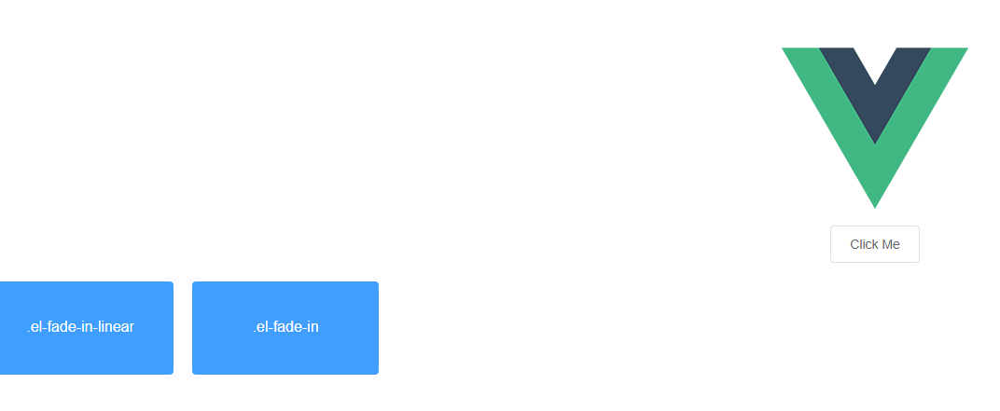

# vue使用elementUI

## vue安装步骤

安装vue
```bash
npm install vue
#安装vue-cli
npm install --global vue-cli
```

因为npm是国外的，使用起来比较慢，使安装vue会出现报错，那么你可以试着  安装 淘宝镜像：

```
npm install -g cnpm --registry=https://registry.npm.taobao.org
cnpm install cnpm -g   
cnpm install vue  
cnpm install --global vue-cli
```

## vue使用脚手架初始化项目
```
vue init webpack vuedemo
```

如果较慢参考 [vue脚手架](vue脚手架.md)

运行项目
```
npm run dev
```

服务能正常启动，访问  http://localhost:8080/

## vue 安装 element UI

安装elementui
```bash
npm i -S  element-ui
```

在package.json可以看到elementui已经安装好了

```
 ...
  "dependencies": {
    "element-ui": "^2.13.2",
    "vue": "^2.5.2",
    "vue-router": "^3.0.1"
  },
 ...
```

在main.js中引入elementui  （main.js是入口文件，所以在这里引入就行，页面就不用引入了）

```
/*引入下面三行*/
import ElementUI from 'element-ui';
import 'element-ui/lib/theme-chalk/index.css';
Vue.use(ElementUI);
```

修改下components->HelloWorld.vue:

```
<template>
  <div>
    <el-button @click="show = !show">Click Me</el-button>

    <div style="display: flex; margin-top: 20px; height: 100px;">
      <transition name="el-fade-in-linear">
        <div v-show="show" class="transition-box">.el-fade-in-linear</div>
      </transition>
      <transition name="el-fade-in">
        <div v-show="show" class="transition-box">.el-fade-in</div>
      </transition>
    </div>
  </div>
</template>

<script>
  export default {
    data: () => ({
      show: true
    })
  }
</script>

<style>
  .transition-box {
    margin-bottom: 10px;
    width: 200px;
    height: 100px;
    border-radius: 4px;
    background-color: #409EFF;
    text-align: center;
    color: #fff;
    padding: 40px 20px;
    box-sizing: border-box;
    margin-right: 20px;
  }
</style>
```

启动服务后如下图 




## 前后端交互

前后端交互，要安装 [axios](http://www.axios-js.com/), 并且在main.js配置（安装跟引入 跟elementui一样）

```
npm i -S axios
```

页面对接代码：
```
axios.get(url).then(res=>{
      if(res.data.retCode == 200){
	 //成功
      }else{
         //失败
      }
})
```

## 参考
1. [Vue+ElementUI 安装与应用](https://www.cnblogs.com/BlueSkyyj/p/11506639.html)
